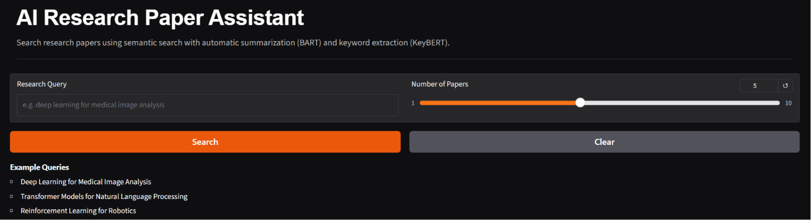
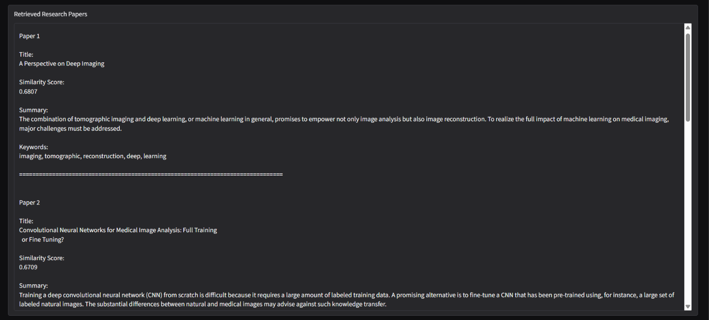

# AI Research Paper Assistant

An AI-powered research assistant that performs semantic search over research papers, generates summaries, extracts keywords, and presents results through an interactive web interface.

---
## Project Overview

Researchers often spend a lot of time reading multiple research papers to find relevant information. This project simplifies that process by allowing users to ask questions in natural language. The system searches research papers based on meaning, retrieves the most relevant papers, summarizes them, extracts important keywords, and presents the results through an interactive web interface.

---

## Features

- Semantic search using Sentence Transformers
- Fast similarity search with FAISS
- Automatic paper summarization using BART
- Keyword extraction using KeyBERT
- Similarity score for retrieved papers
- Interactive Gradio interface
- Research paper exploration through natural language queries

---

## Dataset

This project uses the **ML-ArXiv-Papers** dataset available on the Hugging Face Hub.

- **Dataset:** CShorten/ML-ArXiv-Papers
- **Source:** https://huggingface.co/datasets/CShorten/ML-ArXiv-Papers
- **Size:** Approximately 117,000 machine learning research papers
- **Fields Used:** `title`, `abstract`

The dataset is automatically downloaded from the Hugging Face Hub when the notebook is executed.

---

## Tech Stack

- Python
- Pandas
- Sentence Transformers
- FAISS
- Hugging Face Transformers
- BART
- KeyBERT
- Gradio
- Matplotlib

---

## Project Workflow

Research Papers

↓

Data Cleaning

↓

Sentence Embeddings

↓

FAISS Vector Database

↓

User Query

↓

Semantic Search

↓

Retrieve Relevant Papers

↓

BART Summarization

↓

KeyBERT Keyword Extraction

↓

Display Results

---

## Project Structure

```
AI-Research-Paper-Assistant/
│
├── AI_Research_Paper_Assistant.ipynb
├── README.md
└── requirements.txt
```

---

## Installation

```bash
git clone https://github.com/devikadinesh2003/AI-Research-Paper-Assistant.git

cd AI-Research-Paper-Assistant

pip install -r requirements.txt
```

---

## Run

```bash
jupyter notebook
```

Run all notebook cells and launch the Gradio interface.

---

## Example Queries

- Deep Learning for Medical Image Analysis
- Transformer Models for Natural Language Processing
- Reinforcement Learning for Robotics
- Explain Graph Neural Networks
- Healthcare AI

---
## Interface

The application provides a simple interface where users can enter a research query and specify the number of papers to retrieve.



---

## Search Results

After processing the query, the assistant retrieves the most relevant research papers, along with similarity scores, summaries, and extracted keywords.



---

## Results

- Retrieves semantically relevant research papers
- Generates concise summaries
- Extracts important keywords
- Displays similarity scores
- Provides an interactive search experience

---

## Future Improvements

- Support PDF upload
- Citation generation
- Multi-document question answering
- GPU acceleration
- Export summaries as PDF
- Advanced filtering by author, year, or topic

---

## Author

**Devika Dinesh**

MS in Artificial Intelligence & Data Science

ABV-Indian Institute of Information Technology and Management, Gwalior
